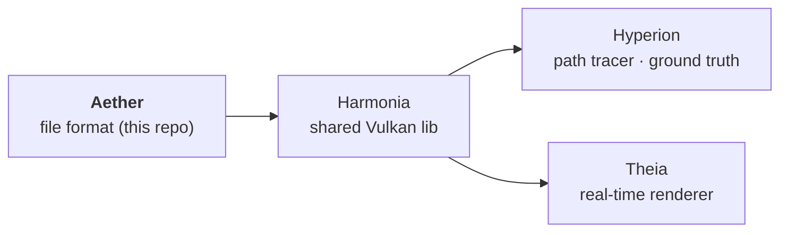

# AGENTS.md — Aether

Quick-start context for AI agents so basic facts don't have to be rediscovered each session.

## What this repo is

**Aether** is the abstract **file-format library** for a four-repo rendering pipeline.
It defines scenes, materials, cameras, tonemap/render presets and the asset loaders.
It holds **GPU-agnostic** scene/material/mesh data only — no renderer code, no Vulkan,
no GPU-optimized layouts.

Pipeline (dependency direction):



- **Hyperion** = path tracer, the **ground-truth** reference renderer.
- **Theia** = real-time mesh-shader rasterizer, being aligned to Hyperion.
- Harmonia/Hyperion/Theia consume Aether via CMake **FetchContent**.

Aether must never reference the renderers. Renderer-aware tooling (e.g.
`compare_renders.py`) lives in Harmonia, not here.

## Assets

`assets/` is the canonical asset tree. `AETHER_ASSETS_DIR` (CMake) =
`${CMAKE_CURRENT_SOURCE_DIR}/assets`.

Material colors are linear Rec.709 unless the material lib says otherwise
(`colorspace = "lin_rec709_scene"`); renderers convert to the working color space.
Format is TOML (chosen as the best token/readability/comment compromise).

**Material model = OpenPBR Surface** (Academy Software Foundation). Material libraries are
tagged `model = "openpbr"` and use **OpenPBR parameter names** (`base_color`, `specular_ior`,
`transmission_weight`, `geometry_opacity`, `coat_*`, `subsurface_*`, `thin_film_*`, …).
OpenPBR's canonical/reference implementation is **MaterialX** (`mx_*` nodes); when adding or
naming parameters, follow OpenPBR/MaterialX, not a renderer-specific convention. The tag exists
so future material models can coexist.

### ⚠️ FetchContent asset gotcha (read this — it bites every session)

Hyperion and Theia do **NOT** read assets from this working tree. They read from their
own FetchContent clone at `<Renderer>/build/_deps/aether-src/assets/`.

So **editing `C:\Development\GitHub\Aether\assets\*.toml` has NO effect on a render**
unless you do one of:
- edit the copy under `<Renderer>/build/_deps/aether-src/assets/` directly, or
- configure the renderer build with `-DFETCHCONTENT_SOURCE_DIR_AETHER=C:/Development/GitHub/Aether`
  (then `aether-src` points at this working tree), or
- copy the edited file into the `_deps` copy before rendering.

Symptom when you forget: two "different" renders produce **byte-identical** metrics.

### Render presets & sample counts (the 16-vs-512 spp trap)

Path-traced references are only clean at high spp. Two presets in `assets/presets/`:
- `comparison_ibl_512spp.render.toml` — **512 spp**, clean IBL reference (e.g. `fixture_ibl`).
- `alignment_16spp_8bounce.render.toml` — **16 spp**, fast *preview* (e.g. `alignment_suzanne`).

Comparing Theia (noise-free) against a **16 spp** IBL reference inflates `mean_diff`
with Monte-Carlo **noise**, not a real discrepancy. For any IBL parity check, render the
Hyperion reference at high spp (`hyperion --spp 256`) before drawing conclusions.

## Build & test

```powershell
cmake -S . -B build -G Ninja -DCMAKE_BUILD_TYPE=Release `
      -DCMAKE_C_COMPILER=clang-cl -DCMAKE_CXX_COMPILER=clang-cl `
      -DCMAKE_TOOLCHAIN_FILE="<vcpkg-root>/scripts/buildsystems/vcpkg.cmake"
cmake --build build
cd build; ctest --output-on-failure
```

## Conventions

- Commit, but do **not** push unless asked.
- OBJ winding must be outward-facing (CCW-from-outside); inward winding renders black
  (Hyperion derives emissive-triangle normals from winding).
- Material model is **OpenPBR Surface** (tagged `model = "openpbr"`, MaterialX-defined); the tag
  exists so future models can coexist.
