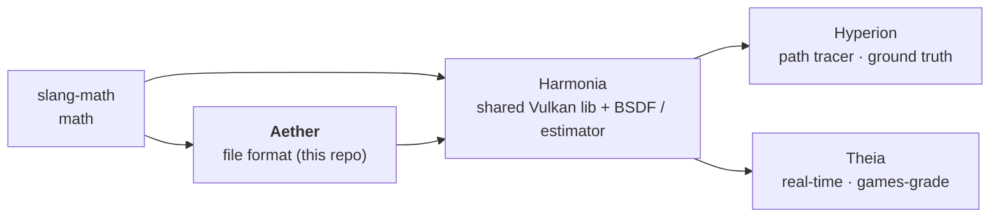

# PLAN — Aether

**Living source of truth for outstanding work.** Shipped items are removed from the work
lists; the shipped record is the *Baseline* below and `git log`. Only outstanding work is
tracked here.

**How to read this plan** — *human / PM:* *How to continue* is the prioritized next-up list.
*AI agent picking up work:* read `AGENTS.md` (orientation, gotchas — especially the
FetchContent asset trap) → *How to continue* (your task) → *Governance* (definition of done +
guardrails) **before editing**.

## Context

Aether is the GPU-agnostic file-format library of a five-repo rendering pipeline:

The family's goal is OpenPBR 1.1.1 as the single material standard, with Theia converging to
Hyperion's unbiased ground truth. Aether owns scene/material/mesh **data** and authoring
tools — never renderer code, never Vulkan. Sibling plans: `Harmonia/PLAN.md`,
`Hyperion/PLAN.md`, `Theia/PLAN.md`, `slang-math/PLAN.md` in the sibling clones.

## At a glance

- **Release:** v0.7.3 (tag-synced with GitHub); consumed via FetchContent pins by
  Harmonia → Hyperion/Theia.
- **Last shipped (v0.7.3):** the opacity-micromap asset format (see Baseline) — part of the
  family's C14/VK2 release (real OpenPBR `geometry_opacity` cutout, Harmonia/PLAN.md).
- **Next:** NH1 (node graph) — it unblocks the animation track (ANI) across the family.

## How to continue

### Node hierarchy track (NH) — Aether slice

Aether today carries flat instances with per-instance TRS (`parseTRS`). A parent/child node
graph lets a child inherit and compound its parent's transform, and enables instanced
subtrees. The shared consumption (transform compounding) lives in Harmonia (NH2,
Harmonia/PLAN.md).

| ID | Task | Deps | Status |
|----|------|------|--------|
| NH1 | **Node graph in Aether** — extend the scene TOML + `SceneParser`: parent/child nodes with compounded TRS; instances reference a node path. Today `InstanceDesc` (`src/aether/types/SceneDesc.hpp:61`) is flat with no parent field. | — | backlog |
| NH4 | **DCC round-trip** — `blender_to_aether` / `mtlx_to_aether` emit the hierarchy (Blender collections/parents → Aether nodes). Standing constraint: Blender authors no OpenPBR, and the MaterialX path rejects non-OpenPBR sources (`tools/README.md`) — hierarchy export does not change that. | NH1 | backlog |

### Animation track (ANI) — Aether slice

| ID | Task | Deps | Status |
|----|------|------|--------|
| ANI1 | **Keyframed transform channels (schema)** — Aether carries the timeline: per-node translate/rotate/scale vs time (interpolated) in the scene format. The renderer-side sampling at shutter time lives in Harmonia/Hyperion/Theia (their PLAN.md files). | NH1 | backlog |

### Downstream-library migration

| ID | Task | Deps | Status |
|----|------|------|--------|
| SM6-Aether | **slang-math v0.3.0 migration slice** — replace the 12 hand-rolled `std::clamp(x,0,1)` lambdas in `src/aether/material/MaterialLibrary.cpp` with `sm::saturate`; bump the FetchContent pin to slang-math v0.3.0 in this repo's release commit. Track origin: slang-math/PLAN.md SM6. | slang-math v0.3.0 tag | backlog |

## Governance

**Definition of done (per change):** `ctest` green **+** warning-clean build (strict
warnings-as-errors: clang-cl `/W4 /WX`, Clang/GNU `-Wall -Wextra -Werror -Wpedantic`; a
compiler warning is a build failure — fix the cause, never silence it). **Per release:** the
above plus `verify-full` (verify + format-check + clang-tidy + cppcheck).

**Guardrails:**

- Aether must never reference the renderers (AGENTS.md) — GPU-agnostic CPU data only.
- **OpenPBR Surface 1.1.1** is the material standard; parameter naming follows OpenPBR /
  MaterialX, never a renderer-specific convention.
- Fix bugs at once — root-caused and patched in the same session. Deferral is not an
  acceptable resolution for a known defect.
- Solve directly, never defer: divergences are root-caused and fixed in code.
- Tags are always pushed to GitHub — after any local tag, verify `git ls-remote --tags
  origin` == `git tag -l`. Release order follows the dependency direction (slang-math →
  **Aether** → Harmonia → Theia/Hyperion); downstream FetchContent pins bump to the fresh tag
  in their own release commits.
- Commit per-repo; push only on explicit OK.
- Living document — done work is removed from this file; the record is the Baseline and
  `git log`.

## Baseline

- **v0.7.3** (current; shipped alongside the family v0.7.7): the **opacity-micromap asset
  format** — `aether::OpacityMicromapData`/`OpacityMicromapGroup`
  (`src/aether/types/OpacityMicromap.hpp`), the `.omm` text-sidecar + `.micromap.toml`
  descriptor importer (`OmmImporter`), `MaterialDesc::map_opacity` (data-space texture),
  `MeshDesc::opacityMicromaps` (OBJ-group → baked-asset reference), and the standalone Python
  baker `tools/omm_bake.py` (PNG decode/encode, OBJ parse, the Vulkan/glTF
  space-filling-curve microtriangle index, conservative range-sampled classification — a
  microtriangle is only ever declared uniform where the renderer's own bilinear/wrap-repeat
  sampling could not disagree). New showcase scene `shaderball_checker.scene.toml` (+materials
  + baked `.omm`/`.micromap.toml` + the checker opacity PNG). 42 ctest green at ship time.
- **BV1** (earlier): `MeshDesc::bounds` — optional authorable object-space AABB
  (`bounds = { min=[...], max=[...] }`) + `tools/obj_bounds.py` (stdlib-only OBJ→AABB,
  `--write` in-place, optional Ritter sphere). Consumers shipped downstream (Harmonia BV2,
  Theia BV3).
- **v0.7.2**: `applyKw` table-driven dispatch (family code-health pass).
- Earlier history in `git log`.
