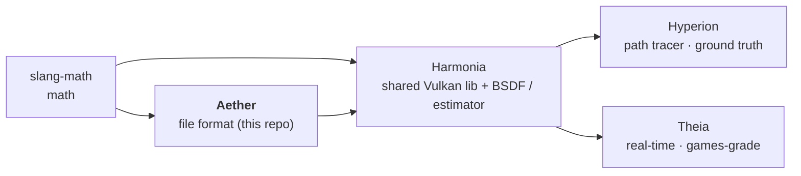

# PLAN — Aether

**Living source of truth for outstanding work.** Shipped items are removed from the work
lists; the shipped record is the *Baseline* below and `git log`. Only outstanding work is
tracked here.

**How to read this plan** — *How to continue* is the prioritized next-up list. Before
editing, read `AGENTS.md` (orientation, gotchas — especially the FetchContent asset trap),
then *How to continue* → *Governance* (definition of done + guardrails).

## Context

Aether is the GPU-agnostic file-format library of a five-repo rendering pipeline:


```mermaid
flowchart LR
    SM["slang-math<br/>math"] --> A["<b>Aether</b><br/>file format (this repo)"]
    SM --> H
    A --> H["Harmonia<br/>shared Vulkan lib + BSDF / estimator"]
    H --> Hy["Hyperion<br/>path tracer · ground truth"]
    H --> T["Theia<br/>real-time · games-grade"]
```

The family's material standard is OpenPBR: currently **1.1.2** (the patch bump landed 2026-11-15 via C16 in `Harmonia/PLAN.md` — older 1.1.x versions are unsupported by declaration); the **1.2** minor spec is a separate later track (C15). Theia converges to
Hyperion's unbiased ground truth. Aether carries the scene/material/mesh **data** and the authoring
tools — never renderer code, never Vulkan. Sibling plans: `Harmonia/PLAN.md`,
`Hyperion/PLAN.md`, `Theia/PLAN.md`, `slang-math/PLAN.md` in the sibling clones.

## At a glance

- **Core format: COMPLETE.** Node graph (NH1), animation clock + tracks
  (ANI1, tick-based via `[animation_clock]`), hierarchical metadata (META1/2),
  and the `aether-validate` assembly gate are the documented, tested contract.
  Next phase: downstream consumption (renderers adopt evaluated flat lists).
- **Release:** v0.8.1 (tag-synced with GitHub) - the slang-math pin bump
  (v0.6.0 -> v0.8.0: additive SM1/SM2/SM3 API). **Prior (v0.8.0):** the
  **core-format release** (NH1 node graph, ANI1 animation, META2 metadata,
  `aether-validate`); consumed via FetchContent pins by Harmonia -> Hyperion/Theia.
- **Last shipped (v0.7.8):** META1 `[meta]` block (agent-legible scene metadata;
  previously mis-attributed to v0.7.7 here — `git tag --contains` starts at
  v0.7.8), A-02 (one `obj_transform` CLI), A-05 (kw tables + pairing invariant),
  SM6 (`sm::saturate`); tests 44->45. Prior (v0.7.7): A-01 `_obj_transform` dedup
  (one parameterized `transform_vec3_line` + thin aliases), A-03 `parseMesh` guard
  clauses, output color-space shim removal, Q1 coverage lane (83.48% lines),
  architecture gate orphan-free.
- **Quality gates (family-uniform):** blocking lint (Q2-Q6) on every push -
  clang-format pinned 22.1.3, ruff contract in `ruff.toml` (identical x5), cppcheck,
  bandit, actionlint 1.7.12, yamllint; plus **blocking coverage CI** (`coverage (Q1)`).
- **Next:** nothing queued in Aether itself - **ANI4 (skinning) and ANI5 (morph
  targets) both landed as slices 2026-11-16** (schema + CPU evaluation references);
  NH1 (node graph), ANI1 (keyframed transform channels) and the META track
  (META1/META2 agent-legible metadata) are done; the remaining work is downstream
  consumption - the ANI5 renderer halves AND the ANI4 DQS follow-up landed
  2026-11-16 (receipts in `Harmonia/PLAN.md`); nothing is queued in Aether.

## How to continue

The Aether items below cover scene description & representation; see the Harmonia plan for
the family-wide ordering.

### Metadata track (META) — agent-legible format

**Goal:** when an agent reads an Aether TOML it *understands* the scene without further
reading — and, crucially, can **skip opening linked files** because their essentials are
summarised inline (what the thing is, its bounds incl. orientation, and enough content
summary to reason about it). Unblocked and independent of AR1/NH1.

| ID | Task | Deps | Status |
|----|------|------|--------|
| META1 | **`[meta]` block in the scene TOML** — optional, backward compatible (existing scenes parse unchanged; unknown tables already ignored). **Landed:** `[meta]` keys — `schema`/`version`, `model = "openpbr"`, `title`, `description` (agent-readable prose), `units`, `generator`, META2 `assembly` — and `[meta.link."<path>"]` per linked file: `kind` (`material-library` \| `mesh` \| `env` \| `micromap` \| `scene`), `description` (e.g. *"Suzanne the monkey — glossy ceramic, this is the snow-scene hero"*), the skip-the-file summary `bounds` = AABB **with frame/orientation** (`{ min, max, frame = "object", orientation = [x,y,z,w] }` — object-space AABB + the instance TRS already in the scene makes the world AABB derivable), content counts (`triangles`, `groups`), and `materials = [...]` (flat name list). Lenient parse (absent/wrong-typed keys keep defaults, never an error), parsed exactly once per scene so mesh-less scenes carry meta too; stored as `SceneMeta`/`LinkMeta`/`LinkBounds` in `src/aether/types/SceneDesc.hpp`, parsed in `SceneParser.cpp`, tests in `tests/test_scene_parser.cpp`. Nothing consumes it yet — the consumer is the agent. The release header once mis-attributed this landing to v0.7.7 — `git tag --contains` starts at **v0.7.8**. **Deferred:** per-material one-liners, material-TOML `[meta]` storage (the material-side half of this row's original scope), generator population (`blender_to_aether`, `mtlx_to_aether`, `omm_bake`). | — | **done (v0.7.8)** |
| META2 | **Hierarchical agent-legible metadata (node level)** — extends META1 to the NH1 graph: `[[node]]` gains `description` (what this node/subtree IS) and `tags` (categorization), and `[meta]` gains `assembly` (prose: how the scene fits together — what the parts are and how they connect). All pure AI context — absent or wrong-typed keys parse leniently and never affect the resolved flat instance list or validation (`NodeDesc`/`SceneMeta` in `src/aether/types/SceneDesc.hpp`, parsed in `SceneParser.cpp`; tests in `tests/test_scene_parser.cpp` cover landing, empty defaults, wrong-type leniency and instance-list invariance). The real consumer exists: **the NH1 node graph is the consumer — hierarchical agent legibility** (an agent reading the TOML understands each subtree and how to assemble the scene). The previous META2 scope (generator-side population + docs) remains deferred. | META1 | **done** |

Schema sketch (scene TOML):

```toml
[meta]
schema = "aether-scene"
version = 1
model = "openpbr"
title = "Suzanne in the snow"
description = "Snow scene: Suzanne (glossy ceramic) on a snowy ground; sun IBL, falling snow via opacity masks."
assembly = "The rig nodes parent the shaderball; the plane is the snowy ground; snow particles hang in a subtree above."
units = { length = "m", luminance = "nits" }
generator = "blender_to_aether/1.2.0"

[meta.link."materials/snow.toml"]
kind = "material-library"
description = "Physically based OpenPBR materials for the snow scene."
materials = ["snow", "ceramic_white"]

[meta.link."meshes/suzanne.obj"]
kind = "mesh"
description = "Suzanne the monkey - glossy ceramic, the snow-scene hero."
bounds = { min = [-0.50, -0.31, -0.42], max = [0.50, 0.48, 0.31], frame = "object", orientation = [0, 0, 0, 1] }
triangles = 2904
groups = 1
```

### Node hierarchy track (NH) — Aether slice

Aether today carries flat instances with per-instance TRS (`parseTRS`). A parent/child node
graph lets a child inherit and compound its parent's transform, and enables instanced
subtrees. Architecture directive: compounding happens loader-side in Aether (NH1) - the
renderers always receive the flat, world-resolved instance list (Harmonia NH2 dropped).

| ID | Task | Deps | Status |
|----|------|------|--------|
| NH1 | **Node graph in Aether** — extend the scene TOML + `SceneParser`: parent/child nodes with compounded TRS; instances reference a node path. Today `InstanceDesc` (`src/aether/types/SceneDesc.hpp:87`) is flat with no parent field. | — | **done** |
| NH4 | **DCC round-trip** - `blender_to_aether` emits the NH1 node graph + animation tracks (done, verified headless on Blender 5.2.3, 1:1 F-curves) **+ the deformation schema (v1.4.0, re-verified on Blender 5.3.0):** armature bones as `<arm>::<bone>` NH1 nodes (conjugated armature-space rest chains), `[[skin]]` (joints in `arm.data.bones` order, IBM from the compounded world, top-4 same-named vertex-group weights), `[[morph]]` shape-key basis deltas in the Y-up frame + `morphs/<mesh>/<key>` weight tracks, and `blend = "lbs"|"dqs"` (operator option). Rows expand in **ObjImporter's deduplicated import order** (flushMesh collapses face corners on resolved values - 6 corners -> 4 vertices on the fixture), proven by `tests/test_blender_roundtrip.cpp` against the committed `skinned`/`skinned_dqs` assets (6-vs-4 negative control, rest-identity deform both modes, weight track drives `deformMorphs`) **+ the ANI8 camera binding (v1.5.0):** `[camera] node = "<camera object>"` when the camera is in the export, camera-node locals/keys PRE-multiplied (`CONV @ R`, the static-[camera] form - plain conjugation swizzles the optical axis and aims 90 degrees off; pinned by `AnimatedCameraNodeAimsAtTheOrigin`), and the committed `camera_orbit`/`skinned_orbit` example scenes (orbit rig + meadow IBL). `mtlx_to_aether` hierarchy emission: **not applicable** - MaterialX is a flat, OpenPBR-only material-library source by directive (complex node graphs out of scope); it emits materials, not scene hierarchies. Standing constraint: Blender authors no OpenPBR, and the MaterialX path rejects non-OpenPBR sources (`tools/README.md`). | NH1, ANI4, ANI5, ANI8 | **done** |

### Animation track (ANI) — Aether slice

**Architecture directive (binding):** ALL animation logic — tracks,
interpolation, evaluation — lives in Aether. The renderers
(Harmonia/Theia/Hyperion) advance the clock and call the evaluation API; they
ALWAYS receive only the flat, world-resolved instance list with the animated
world transforms, and never see keyframes. The time base is deterministic and
tick-based: each scene carries its own animation fps (`[animation_clock] fps`,
required whenever tracks exist) and the renderers advance integer ticks via
`SceneAnimator::evaluateAtTick` (seconds = tick / fps) — independent of the
render rate and exactly reproducible.

| ID | Task | Deps | Status |
|----|------|------|--------|
| ANI1 | **Keyframed transform channels (schema + evaluation)** — `[[animation]]` tracks: `target = "nodes/<id>/<parameter>"` bound against the NH1 node graph, `interpolation` = step / linear / cubic_spline with glTF 2.0 sampler semantics (1:1), clamped sampling outside `[first, last]`, rotation keys normalized at load + samples renormalized (shortest-arc slerp), scale floored away from zero; validation (unknown node/parameter, non-finite values, non-ascending times, wrong arity, empty track) as parse errors. Evaluation: `SceneAnimator::evaluate(scene, t)` — sample tracks → node-local TRS → re-run the NH1 compounding → fully resolved flat instance list. **+ tick clock (`[animation_clock] fps`, `SceneAnimator::evaluateAtTick`) + scalar component targets** (`nodes/<id>/<parameter>/<component>` with per-parameter component validation; rotation components renormalize the whole quaternion; mixed component key times parse and evaluate — the mismatched-F-curve export case now works Aether-side). | NH1 | **done** |
| ANI4 | **Skinning - schema + CPU evaluation reference (Aether slice)** - `[[skin]]` bindings: `node` (the meshed node), `joints` = NH1 node ids (the bone hierarchy IS the node graph; joints animate through ordinary ANI1 `[[animation]]` tracks), per-joint row-major `inverse_bind` (16 floats), per-vertex `bone_indices`/`bone_weights` (4 per vertex). Parser validation: unknown node/joint, one binding per node, matrix count/arity/finiteness, joint-range indices, non-negative finite weights (the vertex COUNT binds later via `validateSkinVertexCounts` - the loader owns the imports). `resolveNodes` now records EVERY node's world matrix into `SceneDesc::nodeWorlds` (validate-before-mutate preserved: a false return leaves desc untouched). `SceneAnimator::evaluateSkins`/`evaluateSkinsAtTick` compose the LOCAL-space skin matrices `inv(nodeWorld) * jointWorld * inverseBind` (documented in `SkinPose`; local-space keeps the instance/BLAS pipeline untouched - the renderer refits its BLAS vertices per frame). `deformSkinLbs` is the CPU reference the GPU halves must match: glTF weight renormalization, zero-sum vertices stay authored, positions blended homogeneously and normals as directions (translation excluded) renormalized; contract violations return nullopt, never a silently-empty deformation. **DQS + the renderer halves (GPU deformation + BLAS refit) remain.** Receipts: suite **123/123** (+21 new: parser accepts/rejects, world compounding + untouched-on-failure, tick-following poses, rigid/blend/renormalize/zero-sum/rotation-normal math, the validator), clang-format + check_dead clean. | NH1, ANI1 | **DQS landed 2026-11-16:** `blend = "lbs" | "dqs"` on `[[skin]]` (default LBS), the shared `skinDualQuaternions` extraction (8 floats per joint - column-normalized rigid projection, **scale dropped**, called by BOTH the CPU reference and the renderer staging, so GPU parity is by shared code) and the `deformSkinDqs` CPU reference (sign-align to the first influence, r/|r| + dual projection, t = 2*vec(dual*conj(real)); LBS-mirrored fallbacks). Receipts: suite **150/150** (+8: single-joint DQS == LBS == the analytic rigid transform, the candy-wrapper receipt - +-80 degree blend preserves length where LBS collapses to cos(80), the near-360 sign-alignment rescue, the scale-drop contract, zero-sum/contract/degenerate-matrix fallbacks, the joint-major DQ layout, blend-key parse + reject), clang-format + check_dead clean; the renderer half rides Harmonia's DeformPass (receipts in `Harmonia/PLAN.md` ANI4). | NH1, ANI1 | **done** |
| ANI5 | **Morph targets - schema + CPU evaluation reference (Aether slice)** - `[[morph]]` blocks: `mesh` (an object/box mesh - procedural spheres are rejected at parse, the ANI4 no-stable-count rule), `name` (unique per mesh), optional `weight` (initial scalar, default 0, any finite value - no clamping) and `deltas` (one `[dx, dy, dz]` row per vertex, import-order concatenation exactly like `[[skin]]` rows; the per-target ROW COUNT binds later through `validateMorphVertexCounts` - the loader owns imports). Live weights sit in the parallel `SceneDesc::morphWeights` vector and animate through ANI1 `[[animation]]` tracks with the NEW `morphs/<mesh>/<name>` grammar: a dedicated arity-1 `MorphWeight` registry row (plain value lerp) whose `evaluate()` writes `morphWeights[morphIndex]` instead of a node TRS, while the `nodes/` path rejects the `weight` token by name so a node can never drive a morph by accident. `SceneAnimator::evaluateMorphWeights(AtTick)` returns the live weights (authored initials without tracks; one evaluate copy per call - the shared budget); `deformMorphs` is the CPU reference the GPU kernel must match: `p' = p + sum(w_t * delta_t)`, POSITION-only (normals are NOT re-derived - documented v1 contract), weight 0 contributes nothing, contract violations return nullopt. Receipts: suite **142/142** (+19: 9 parser accepts/rejects incl. sphere + duplicate + non-finite, 4 track-grammar tests incl. the unknown-target and nodes-path guards, 3 deform-math tests (single/2x weight + two-target composition + contract breaks), 3 validator tests), clang-format + check_dead clean; downstream lockstep Harmonia 175/175 + Theia 61/61 + Hyperion 43/43. **Renderer halves pending** (GPU kernel + per-tick orchestration on the ANI4 pass pattern - the rest/active split carries over). | ANI1 | **done** - the renderer halves landed 2026-11-16 (unified rest->morph->skin dispatch matched against `deformMorphs` + composition; receipts in `Harmonia/PLAN.md`) |

## Governance

**Definition of done (per change):** `ctest` green **+** warning-clean build (strict
warnings-as-errors: clang-cl `/W4 /WX`, Clang/GNU `-Wall -Wextra -Werror -Wpedantic`; a
compiler warning is a build failure — fix the cause, never silence it). **Per release:** the
above plus `verify-full` (verify + format-check + clang-tidy + cppcheck).

**Guardrails:**

- Aether must never reference the renderers (AGENTS.md) — GPU-agnostic CPU data only.
- **OpenPBR Surface** is the material standard: conformance target **1.1.2** on its release (1.1-line patch; older versions unsupported by declaration; the **1.2** minor spec is a separate track); parameter naming follows OpenPBR /
  MaterialX, never a renderer-specific convention.
- Fix bugs at once — root-caused and patched immediately. Deferral is not an
  acceptable resolution for a known defect.
- Solve directly, never defer: divergences are root-caused and fixed in code.
- Tags are always pushed to GitHub — after any local tag, verify `git ls-remote --tags
  origin` == `git tag -l`. Release order follows the dependency direction (slang-math →
  **Aether** → Harmonia → Theia/Hyperion); downstream FetchContent pins bump to the fresh tag
  in their own release commits.
- Commit per-repo; push only on explicit OK.
- Living document — done work is removed from this file; the record is the Baseline and
  `git log`.

## Baseline

- **v0.9.0** (current): **deformation schema release.** ANI4 skinning (`[[skin]]` + parser validation, node-world exposure via `resolveNodes`, `evaluateSkins(AtTick)` LOCAL-space matrices, the `deformSkinLbs` CPU reference + bind-time validation, `blend = lbs|dqs` + `skinDualQuaternions` shared extraction + `deformSkinDqs` reference) and ANI5 morph targets (`[[morph]]`, the `morphs/<mesh>/<name>` weight-track grammar with the guarded `weight` token, `evaluateMorphWeights`, `deformMorphs`). 150/150 ctest.
- **v0.8.0**: **core format release.** NH1 node graph (compounded TRS,
  instanced subtrees, graph validation), ANI1 animation (`[[animation]]` tracks,
  `[animation_clock]` fps, tick-based deterministic `evaluateAtTick`, parameter
  registry with clamp/normalize validity), META2 (node descriptions/tags,
  `[meta] assembly`), `aether-validate` CLI, robust meta parsing. 100/100 ctest.
- **v0.7.8**: **tools + kw tables + SM6.** A-02 (one `tools/obj_transform.py` CLI, the seven per-axis scripts removed after a 13/13 byte-identity matrix), A-05 (dispatch tables hoisted to `MaterialKwTables.hpp` + pairing-invariant test), SM6 (material weight clamps via `sm::saturate`), slang-math pin v0.4.0, blocking coverage CI. 45/45 ctest, gate clean.
- **v0.7.7**: **cleanup + quality.** A-01 dedup (the identical transform
  functions in `_obj_transform` -> one parameterized `transform_vec3_line` + thin aliases),
  A-03 guard-clause flattening of the `parseMesh` bounds nesting, the Q1 coverage lane
  (`AETHER_COVERAGE` + `tools/coverage.py`, verified 83.48% lines), and the architecture gate
  (vendored check-arch engine, orphan-free). 44/44 ctest, gate clean.

- **v0.7.6**: **dead surface removed + architecture gate.**
  The `Aether.hpp` umbrella header had zero consumers in all five repos (no include, no
  CMake reference) — deleted per the only-latest-and-greatest rule. `tools/check_layers.py`
  (ctest `test_layers`, label `analysis`): the module DAG `aether/types` ← `aether/format`
  ← root, file-level cycle detection, and any `harmonia/`/`theia/`/`hyperion/` include
  fails (Aether sits below Harmonia; the sibling renderers are out of reach). 44/44 ctest
  on Windows; Linux suite green.
- **v0.7.5** (family-wide release): **dual-OS CI + badge; test
  registration for the CI ctest lane.** `.github/workflows/build.yml` on `windows-latest` +
  `ubuntu-26.04` with the Git LFS asset checkout (the family's LFS content lives in Aether); the
  CPU suite runs in CI (43/43 on both OSes); `tests/CMakeLists.txt` registers the CI ctest
  lane. **No library code changes since v0.7.4** — the parser and format are identical, so
  downstream pins may remain at v0.7.4 until the next release.
- **v0.7.4** (ships alongside the family v0.7.8): **OpenPBR 1.1.1 spec-default
  conformance** — `coat_ior` default 1.6 (was 1.5), `thin_film_ior` default 1.4 (was 1.5),
  `thin_film_thickness` default 500 nm (spec 0.5 µm; was 0) — inert for all shipped assets
  (every coated/thin-film material sets the parameters explicitly) — and the parser now
  accepts `specular_weight` > 1 (spec range [0,∞); the mandated ξ_s·F_s ≤ 1 clamp lives in
  the shader, Harmonia v0.7.8). **Tooling**: `CMakePresets.json`
  (`win` = Ninja + Release + clang-cl + `$env{VCPKG_ROOT}` toolchain),
  `tools/check_tidy.py` (parallel classified clang-tidy lane) + ctest `test_tidy` (label
  `analysis`), `AETHER_SANITIZER` option (Clang/GCC), deterministic host FP
  (`/fp:strict` / `-ffp-contract=off -fno-fast-math`). 43 ctest green at ship time (incl.
  the tidy lane).
- **v0.7.3** (shipped alongside the family v0.7.7): the **opacity-micromap asset
  format** — `aether::OpacityMicromapData`/`OpacityMicromapGroup`
  (`src/aether/types/OpacityMicromap.hpp`), the `.omm` text-sidecar + `.micromap.toml`
  descriptor importer (`OmmImporter`), `MaterialDesc::map_opacity` (data-space texture),
  `MeshDesc::opacityMicromaps` (OBJ-group → baked-asset reference), and the standalone Python
  baker `tools/omm_bake.py` (PNG decode/encode, OBJ parse, the Vulkan/glTF
  space-filling-curve microtriangle index, conservative range-sampled classification — a
  microtriangle is only ever declared uniform where the renderer's own bilinear/wrap-repeat
  sampling could not disagree). New showcase scene `shaderball_checker.scene.toml` (+materials
  + baked `.omm`/`.micromap.toml` + the checker opacity PNG). 42 ctest green at ship time.
- **BV1** (earlier): `MeshDesc::bounds` — optional authorable object-space AABB
  (`bounds = { min=[...], max=[...] }`) + `tools/obj_bounds.py` (stdlib-only OBJ→AABB,
  `--write` in-place, optional Ritter sphere). Consumers shipped downstream (Harmonia BV2,
  Theia BV3).
- **v0.7.2**: `applyKw` table-driven dispatch.
- Earlier history in `git log`.
